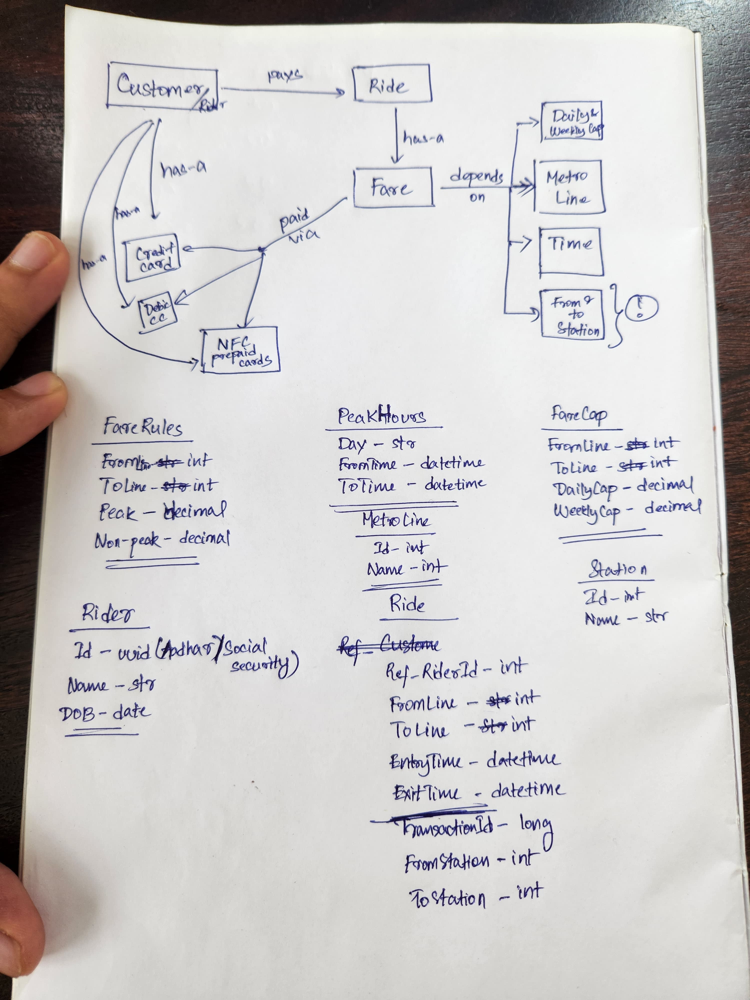

# Singa Metro Authority Fare Calculator API

## Release
https://smafarecalculator.azurewebsites.net/swagger/index.html

### API Input
Every trip information in csv format and every trip separated by a `;`:

``{fromMetroLine_1},{toMetroLine_1},{timeInUtc_1};{fromMetroLine_2},{toMetroLine_2},{timeInUtc_2};...{fromMetroLine_X},{toMetroLine_X},{timeInUtc_X};``

Sample json input -
```json
{
  "trips": "Green,Green,2021-03-24T07:58:30;Green,Red,2021-03-24T09:58:30;Red,Red,2021-03-25T11:58:30"
}
```

### API Output
Outputs the total fare - 
```json
{
  "totalFare": 7
}
```
## Design

### ER Diagram



The design is flexible enough to accommodate new metro lines without any downtime or the need for app deployment, 
as fare rules are dynamically [fetched from the (in-memory) database](https://github.com/tushardevsharma/sma-fare-calculator/blob/3f6199dd4f568c25d26346f9770768929e473a69/src/SMAFareCalculator.Service/FareService.cs#L16). 
The core fare calculation algorithm is built in a [generic fashion](https://github.com/tushardevsharma/sma-fare-calculator/blob/3f6199dd4f568c25d26346f9770768929e473a69/src/SMAFareCalculator.Service/FareCalculationExtensions.cs#L86-L89),
allowing it to easily incorporate new metro lines, daily/weekly fare caps, and any additional parameters
that may influence fares in the future

## Future Work

- Currently, the system does not offer any form of persistence, meaning there’s no way to track a rider's trip history.
This is important because daily and weekly fare caps directly affect how much a rider needs to pay. A natural next step would be
to introduce a "ride history" feature, allowing the system to calculate fares based on both current inputs and the rider's past
trips. This change will also require implementing a unique rider identification system, meaning we’ll need to introduce
registration and login functionality.

- At present, the system scales infinitely since it operates entirely in-memory without a database. However, once persistence
is introduced, a key bottleneck will be retrieving a rider’s trip history, as every fare calculation will depend on this data.
Therefore, choosing the right database to store trip histories is crucial. A NoSQL database seems like a good fit for handling
all riders' trip histories, but we’ll need to account for eventual consistency. That said, given our use case, this shouldn't be
an issue—most NoSQL systems reach consistency far quicker than the interval between a rider's consecutive trips.

## Tests
The API functionality is covered by [these automated tests](https://github.com/tushardevsharma/sma-fare-calculator/blob/3f6199dd4f568c25d26346f9770768929e473a69/src/SMAFareCalculator.Tests/FareCalculatorTripsTestDataExtn.cs#L3).